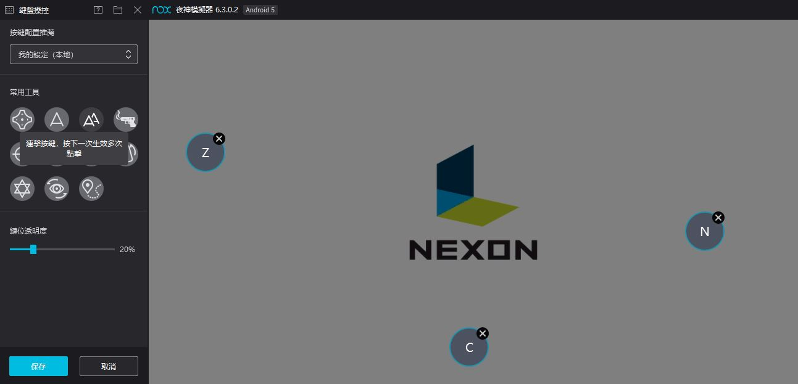

# MapleStoryM-AutoQuest
Using Convolution Neural Network to identify current situation and click relative button to execute quest automatically.

Virtual keyboard of Android PC simulator must be set before using!

The essential setting of running quest automatically see the following.

  

`Auto Quest model.ipynb` is to train the image classification model using keras and tensorflow.

`Auto Quest Run.ipynb` is to catch screenshot frame by frame as model input and press relative virtual button in Android simulator.

# A quick demo :
<kbd align="center">
   
</kbd>